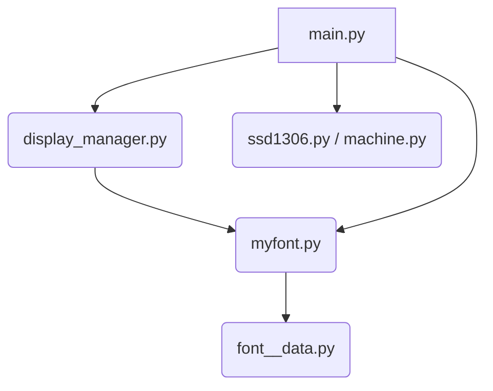

# BERTONE X1/9e Electric Dashboard – MicroPython Zero-Flicker OLED
 
[](https://micropython.org)
[](https://www.longan-labs.cc/can-bus/canbed.html)
[](LICENSE)
[](https://github.com/Fhiel/micropython-bertone-dashboard/stargazers)

**1983 BERTONE X1/9e – fully converted to electric drive**  
Triple 128×32 SSD1306 OLED dashboard with pixel-perfect 12x16 and 16×21 font  
Zero flicker thanks to dirty-rect + permanent subtext + async updates


## Reason for this project
The reason why I used micropython for this project was that all three OLED's with the same I2C Hardware adress worked out of the box with the standard 8x8 Font. Three OLED on I2C, one hardware and two software with a RP2040. A situation that wasn't possible with my first approach on Android. But this luck was the end of lightness.

## Core Display Implementation Challenge
The primary reason for the extended debugging process was a fundamental misunderstanding and incorrect implementation of the Vertical Byte Storage (VLSB) architecture used by the SSD1306 OLED controller.

The SSD1306 Data Structure:
The display is divided internally into horizontal pages, each 8 pixels high. Crucially, every byte in the display buffer does not represent a horizontal row of pixels (as is common in many graphics formats), but rather a vertical 8-pixel column. Bits 0-7 of that byte correspond to pixels 0-7 in that column.

The Root Cause:
In early versions, the logic for converting raw pixel data into this VLSB format and, critically, placing it correctly on the display, was flawed.

Faulty Byte Packing: The raw pixel data in font_converter.py was not being correctly packed into vertical bytes.

Incorrect Y-Offset Shifting: The MyFont.text function requires complex Y-Offset Shifting logic to handle fonts whose height (e.g., 21 pixels) does not perfectly align with the 8-pixel page boundaries, causing data to span multiple pages.

The Consequence:
If the byte packing or the shifting logic is incorrect by even a single bit, the resulting data written to the buffer is not a mirrored or misplaced character, but effectively "pixel garbage" (random noise).

The first legible character only appeared once the combination of the correct VLSB data layout (generated by font_converter.py) and the complex bit-shifting logic (in MyFont.text) was perfectly aligned. All other display settings (like rotation or mirroring) would have failed because the underlying data structure was corrupted.

## Features
- 3× SSD1306 (Central + Odometer + RND)
- 16×21 + 12×16 pixel-perfect font (MONO_VLSB)
- Dirty-rect updates (only changed pixels)
- Permanent subtext (drawn once)
- Invert on Reverse gear
- Async-safe, contrast caching
- Boot animation "BERTONE"

## Hardware
- Longan CANBED RP2040
- 2× 128×32 and 1x 64x32 OLED (I2C)
- Real car tested – 150+ km/h

## Project Structure and Module Dependencies

The project follows a clear, layered architecture to separate the application logic (Display Management) from the presentation (Font Rendering) and the necessary hardware connectivity.

Dependencies primarily flow from top to bottom:



## 1. main.py (The Main Controller)

Role: The application's entry point. Responsible for initializing the hardware (I2C, OLED displays), instantiating the custom fonts (MyFont), creating the shared data object, and starting the asynchronous main loop (asyncio).

Dependencies: Imports display_manager.py, myfont.py, and the low-level hardware libraries (machine, ssd1306).

Core Task: Defines the MyFont instances and passes the initialized display objects to the display_manager. Starts the main asyncio tasks.

## 2. display_manager.py (The Application Logic)

Role: Contains all the high-level logic for displaying various telemetry data (Speed, RND, Temperatures). Manages the "Dirty Rect" optimization technique to update only the changed areas of the OLED buffers, significantly reducing display flicker.

Dependencies: Imports myfont.py for drawing the custom, large characters. Uses the global display objects (set in main.py) to update the screens.

Core Task: Translates the raw data from the shared_data object into formatted strings and calls the font.text() method to blit them onto the display.

## 3. myfont.py (The Rendering Engine)

Role: Implements the core rendering logic for custom fonts on the SSD1306 display buffer. It handles the critical Vertical Byte Storage (VLSB) Shifting logic, which is necessary to correctly position fonts with heights that are not perfect multiples of 8 pixels (e.g., 21px). This complex logic ensures the font data is correctly split and shifted across multiple 8-pixel pages.

Dependencies: Imports the compiled font data (font_<size>_data.py).

Core Task: The text() method calculates the Y_OFFSET and performs the necessary bit manipulations to write the VLSB data precisely into the display's framebuf buffer.

## 4. font_converter.py (The Build Tool)

Role: A separate utility script used exclusively for compiling the font data. It is not executed on the microcontroller hardware.

Dependencies: Imports the raw pixel data (raw_font.py).

Core Task: Reads the raw pixel arrays, applies the VLSB conversion rule (packing vertical pixel columns into bytes), and saves the resulting, optimized binary data into static Python files (font_<size>_data.py).

## 5. font_<size>_data.py (The Data Artifacts)

Role: Static Python files (e.g., font_large_data.py) that contain the pre-compiled VLSB byte arrays for every character supported by the font.

Dependencies: None (They are imported by myfont.py).

Core Task: Provide the optimized binary data that myfont.py uses to quickly transfer the character shapes to the display buffer for rendering.

```python
from display_manager import update_odometer_display, update_central_display, update_rnd_display
MIT License • Made with love for the electric BERTONE X1/9e
Special thanks to Gemini (AI) – without that this would still be 8×8 garbage
